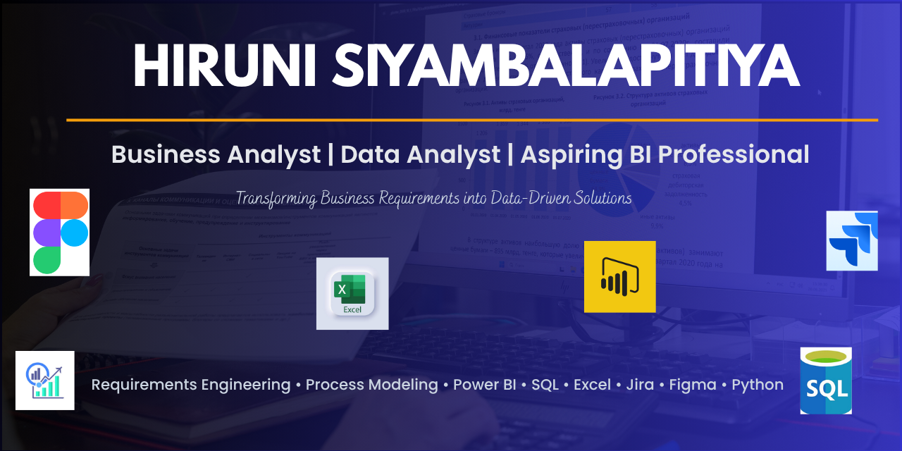

  

# Hi 👋 I'm Hiruni Siyambalapitiya

### Business Analyst | Data Analyst

🎓 Bachelor of Information Technology Graduate

📍 Sri Lanka

💡 Passionate about solving business problems through data analysis, process improvement, and technology-driven solutions.

## 🛠️ Technical Skills

### 📊 Business Analysis
- Requirement Gathering
- Requirement Documentation
- Process Modeling
- User Stories
- Use Case Diagrams
- BPMN
- Stakeholder Management
- Agile & Scrum

### 📈 Data Analytics
- Power BI
- SQL
- Microsoft Excel
- Python (Basics)
- Data Cleaning
- Data Visualization
- Dashboard Development

### 💻 Development Tools
- Git & GitHub
- Figma
- Jira
- Postman
- VS Code

## 🛠️ Business Analysis & Data Analytics Tools

## 💻 Development Technologies

# 🚀 Featured Projects

## 🚢 Bulk Shipment Tender Management System
**Business Analyst | Full-Stack Web Application**

Developed during my internship to digitize supplier tender and bulk cargo shipment operations. The system centralized supplier management, tender tracking, vessel scheduling, cargo details, inspections, and payment processes, replacing manual workflows with an integrated digital platform.

**Key Contributions**
- Conducted requirements gathering and business process analysis
- Prepared user stories and functional requirements
- Designed ER diagrams and database structure
- Developed modules using the MERN stack
- Collaborated with stakeholders and the development team

**Skills**
Business Analysis • Requirements Gathering • Process Modeling • ER Diagram • User Stories • MERN Stack • MongoDB • React • Node.js

🔗 **Repository:** https://github.com/hiruni-siyambalapitiya/Bulk-Shipment-Tender-Management-System

---

## 🍽️ Restaurant Management System
**Business Analysis | MERN Stack**

A web-based Restaurant Management System developed to digitize restaurant operations, including customer ordering, inventory management, delivery coordination, and reporting.

**Key Contributions**
- Requirements Analysis
- Process Modeling
- User Management Module
- Test Case Design
- UI Validation
- MERN Stack Development

**Skills**
Business Analysis • SQL • MongoDB • React • Node.js • Express • Jira • Figma

🔗 **Repository:** https://github.com/hiruni-siyambalapitiya/restaurant-management-system-client-project

---

### 💍 Wedding Management System

Business Analysis documentation including BRD, SRS, UML diagrams, User Stories, Wireframes, and Process Models.

➡️ Repository: https://github.com/hiruni-siyambalapitiya/wedding-management-system-BA

## 📊 Supply Chain Dashboard
Power BI dashboard providing insights into supplier performance, inventory, and operational KPIs.

**Skills**
Power BI • SQL • Excel • Data Visualization

---

## 🏦 Banking Digital Adoption Dashboard
Interactive Power BI dashboard analyzing customer digital banking adoption.

**Skills**
Power BI • SQL • Data Analytics

## 📈 GitHub Stats

## 📫 Connect With Me

💼 LinkedIn: https://linkedin.com/in/your-profile

📧 Email: your-email@example.com

📄 Resume: https://hirunisiyambalapitiyaportfolio.lovable.app

> *"Turning business requirements into meaningful insights and practical solutions."*
